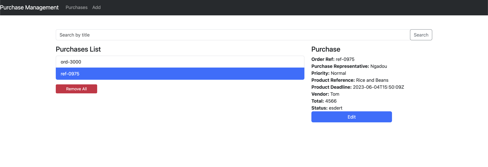

# Full-Stack Software Engineer: Technical Test

## Build the stack and start the application
```bash
docker-compose up --build
```
Note: It might take some time on first start

## Run the stack manually

### Start the database
Using Docker:
```bash
docker-compose up -d db
```

Else, you can use your own database and set the environment variables in the ./mspurchasing/settings.py file accordingly.

```bash
python3 -m venv env
source env/bin/activate  # On Windows use `env\Scripts\activate`


# For the backend
cd mspurchasing
pip install -r requirements.txt
python manage.py migrate
python manage.py runserver

# For the frontend
cd mswebclient
npm install
npm run dev
```

The backend is running on
http://localhost:8000



.   

